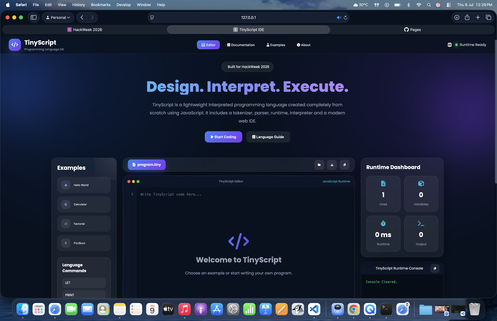
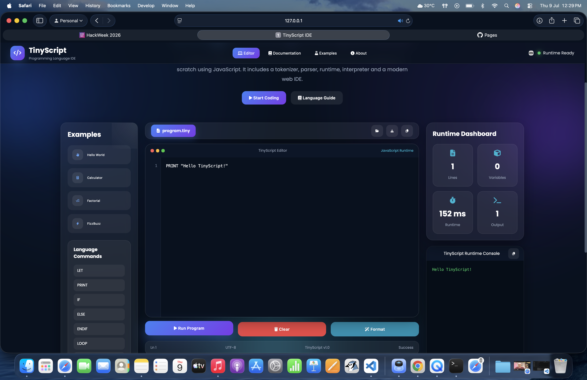
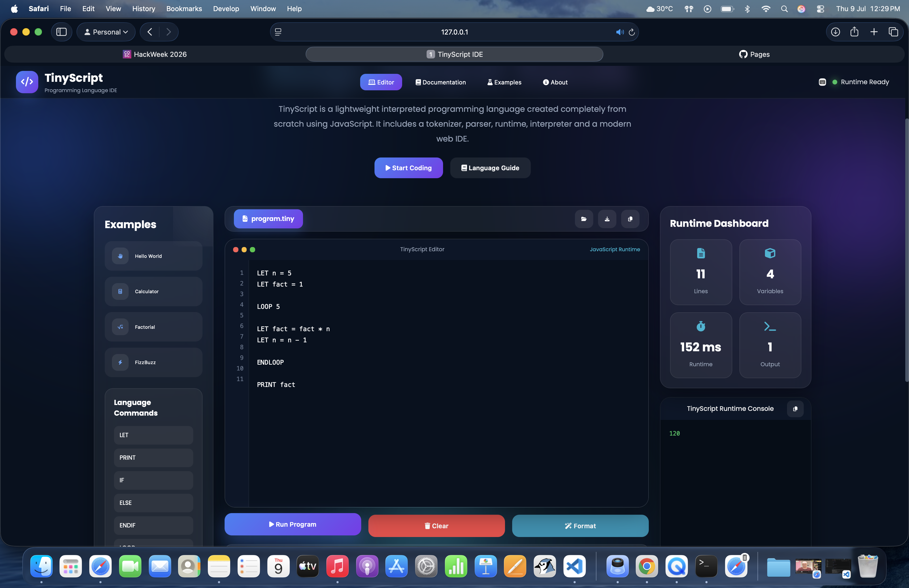
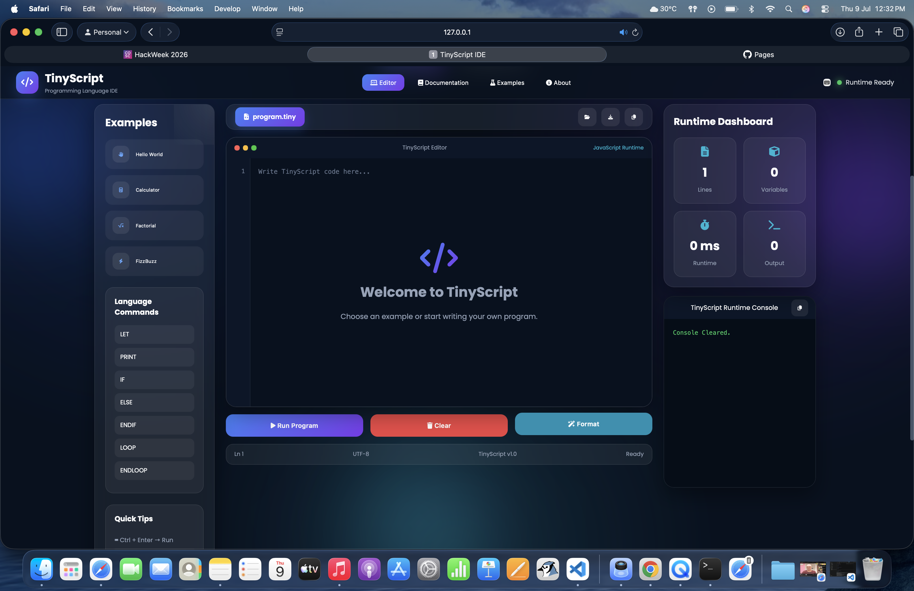
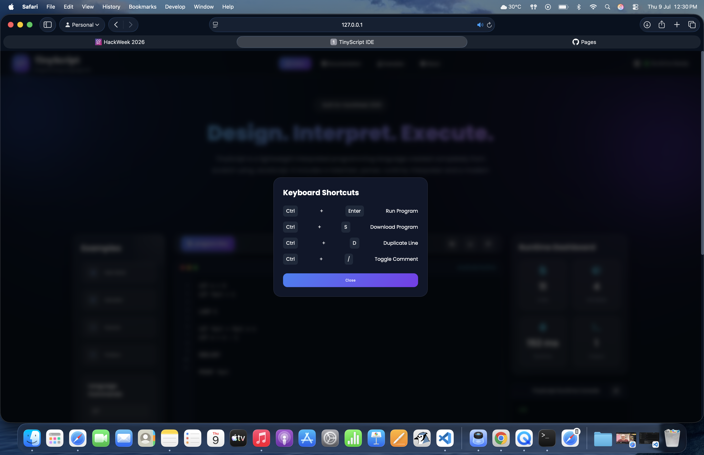

# 🚀 TinyScript IDE

A modern browser-based IDE for **TinyScript**, a custom interpreted programming language built completely from scratch using JavaScript.

Developed as part of **HackWeek 2026**, this project demonstrates the complete implementation of a programming language including lexical analysis, parsing, runtime execution, and interpretation through an elegant web interface.

---

## ✨ Features

- 🖥️ Modern Web IDE
- ⚡ Custom TinyScript Programming Language
- 🔤 Tokenizer (Lexical Analyzer)
- 🌳 Parser
- 🧠 Interpreter
- ⚙️ Runtime Engine
- 📄 Syntax Highlight Inspired Editor
- ▶️ One Click Program Execution
- 📊 Runtime Dashboard
- 📂 Upload `.tiny` Programs
- 📥 Download Programs
- 💾 Auto Save using Local Storage
- ⌨️ Keyboard Shortcuts
- 📋 Copy Code & Output
- 📱 Responsive UI
- 🎨 Premium Glassmorphism Interface

---

# 📸 Screenshots

## Home



---

## Hello World Example



---

## Calculator Example


---

## Factorial Example



---

## Runtime Dashboard



---

## Keyboard Shortcuts



# 🛠️ TinyScript Language

TinyScript currently supports:

| Command | Description |
|---------|-------------|
| `LET` | Create variables |
| `PRINT` | Display output |
| `IF` | Conditional execution |
| `ELSE` | Alternate condition |
| `ENDIF` | End conditional block |
| `LOOP` | Repeat instructions |
| `ENDLOOP` | End loop |

---

# 💻 Example Program

```tiny
LET x = 10
LET y = 20

PRINT x + y
```

Output

```
30
```

---

# 🏗️ Project Architecture

```
TinyScript IDE
│
├── Tokenizer
│
├── Parser
│
├── Runtime
│
├── Interpreter
│
├── IDE Interface
│
└── Output Console
```

---

# 📁 Project Structure

```
TinyScript-IDE/

│

├── index.html

├── style.css

├── script.js

│

├── js/

│   ├── tokenizer.js

│   ├── parser.js

│   ├── runtime.js

│   └── interpreter.js

│

├── assets/

│

└── README.md
```

---

# 🚀 Getting Started

Clone the repository

```bash
git clone https://github.com/YOUR_USERNAME/TinyScript-IDE.git
```

Open the project

```bash
cd TinyScript-IDE
```

Run

Simply open

```
index.html
```

in your browser.

---

# 🎯 Technologies Used

- HTML5
- CSS3
- JavaScript (ES6)
- LocalStorage API
- Font Awesome
- Google Fonts

---

# 📚 Learning Objectives

This project was created to understand how programming languages work internally by implementing:

- Lexical Analysis
- Parsing
- Abstract Syntax Processing
- Runtime Execution
- Interpretation
- IDE Design

---

# 🌟 Future Improvements

- Functions
- Arrays
- User Input
- Debugger
- Error Highlighting
- Syntax Highlighting
- Code Formatter
- Package Manager

---

# 👨‍💻 Author

**Kailash Maganti**

HackWeek 2026 Submission

---

# 📄 License

This project is licensed under the MIT License.
